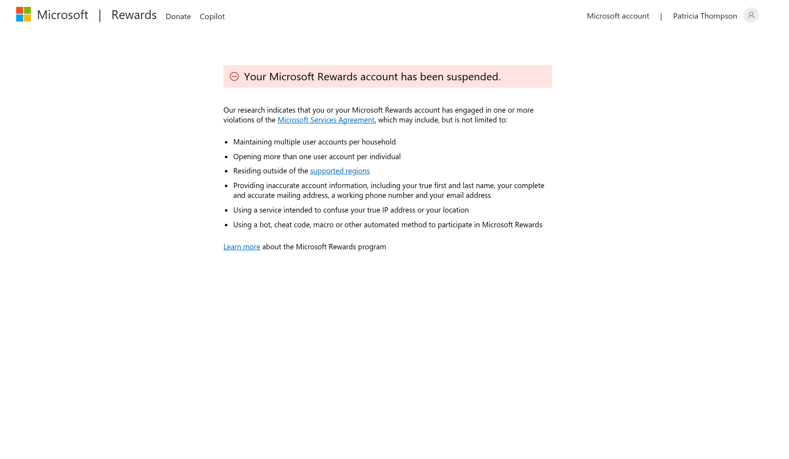

<a id="readme-top"></a>

[![Contributors][contributors-shield]][contributors-url]
[![Forks][forks-shield]][forks-url]
[![Stargazers][stars-shield]][stars-url]
[![Issues][issues-shield]][issues-url]
[![GPL-3.0 License][license-shield]][license-url]

<!-- PROJECT LOGO -->
<br />
<div align="center">

  <h3 align="center">RaxyMS</h3>

  <p align="center">
    A distributed automation framework built with Python, Clean Architecture, and professional-grade design patterns — born from a childhood project reimagined with real engineering.
    <br />
    <a href="docs/index.md"><strong>Explore the docs »</strong></a>
    <br />
    <br />
    <a href="https://github.com/leonifrazao/RaxyMS-Security-Audit">Repository</a>
    &middot;
    <a href="https://github.com/leonifrazao/RaxyMS-Security-Audit/issues/new?labels=bug&template=bug-report---.md">Report Bug</a>
    &middot;
    <a href="https://github.com/leonifrazao/RaxyMS-Security-Audit/issues/new?labels=enhancement&template=feature-request---.md">Request Feature</a>
  </p>
</div>


<!-- TABLE OF CONTENTS -->
<details>
  <summary>Table of Contents</summary>
  <ol>
    <li>
      <a href="#the-story">The Story</a>
    </li>
    <li>
      <a href="#about-the-project">About The Project</a>
      <ul>
        <li><a href="#what-i-learned">What I Learned</a></li>
      </ul>
    </li>
    <li><a href="#technical-stack">Technical Stack</a></li>
    <li>
      <a href="#architecture--design-patterns">Architecture & Design Patterns</a>
      <ul>
        <li><a href="#code-structure">Code Structure</a></li>
      </ul>
    </li>
    <li><a href="#features">Features</a></li>
    <li>
      <a href="#how-it-works">How It Works</a>
      <ul>
        <li><a href="#execution-pipeline">Execution Pipeline</a></li>
      </ul>
    </li>
    <li>
      <a href="#installation">Installation</a>
      <ul>
        <li><a href="#option-1-using-nix-recommended">Nix</a></li>
        <li><a href="#option-2-manual-installation">Manual</a></li>
      </ul>
    </li>
    <li><a href="#usage">Usage</a></li>
    <li><a href="#why-it-doesnt-work">Why It Doesn't Work</a></li>
    <li><a href="#contributing">Contributing</a></li>
    <li><a href="#license">License</a></li>
    <li><a href="#contact">Contact</a></li>
    <li><a href="#acknowledgments">Acknowledgments</a></li>
  </ol>
</details>


<!-- THE STORY -->
## The Story

When I was 12, I built a janky bot to farm Robux on Roblox. It barely worked, the code was terrible, and I learned more from that broken script than from any tutorial.

Years later, I revisited the same concept, automated interaction with a rewards platform. But this time the goal was completely different. I wasn't trying to exploit anything. I already knew modern anti-bot systems had evolved far beyond what a simple script could bypass. **I wanted to see if I could build the same idea with real software engineering.**

The result is RaxyMS: a distributed automation framework built with Clean Architecture, Dependency Injection, Domain-Driven Design, and an async pipeline. The domain happens to be Microsoft Rewards automation, but the project exists as an **exercise in software architecture and systems design**.

> **Does it work for farming points?** No. Microsoft detects and blocks automated activity. Accounts get suspended, points can't be redeemed. The anti-bot systems win — as expected.
>
> **Does it work as an engineering portfolio piece?** That's the point.

<p align="right">(<a href="#readme-top">back to top</a>)</p>


<!-- ABOUT THE PROJECT -->
## About The Project

**RaxyMS** is a Python automation framework that implements a full pipeline: account management, proxy rotation, headless browser orchestration, batch processing, and real-time monitoring — all structured with professional-grade architecture.

The project was built to practice and demonstrate:

- **Clean Architecture** with strict layer separation
- **Dependency Injection** with a centralized container
- **Domain-Driven Design** with isolated business entities
- **Async distributed processing** with batch orchestration
- **Infrastructure abstraction** with swappable adapters (SQLite ↔ Supabase)
- **Professional CLI** with Typer and Rich dashboard

The application domain (rewards automation) was chosen because it's a problem space I've understood since childhood — which let me focus entirely on architecture and engineering quality rather than learning a new domain.

<p align="right">(<a href="#readme-top">back to top</a>)</p>


### What I Learned

Building this project taught me more about real-world software engineering than any course:

| Area | Lesson |
| :--- | :--- |
| **Architecture** | How Clean Architecture and DDD work in practice, not just theory |
| **Dependency Injection** | Why DI containers matter when a system grows beyond a few files |
| **Async Programming** | Managing concurrent browser sessions with shared state |
| **Infrastructure** | Proxy lifecycle management, network tunneling, dual storage sync |
| **Anti-Bot Systems** | How behavioral analysis, fingerprinting, and multi-layer detection actually work |
| **DevOps** | Reproducible environments with Nix, cross-platform packaging |

<p align="right">(<a href="#readme-top">back to top</a>)</p>


<!-- TECHNICAL STACK -->
## Technical Stack

| Technology | Purpose |
| :--- | :--- |
| [![Python][Python.org]][Python-url] **Python 3.10** | Core language |
| [Botasaurus](https://github.com/omkarcloud/botasaurus) | Headless browser automation |
| [Typer](https://typer.tiangolo.com/) | CLI framework |
| [Rich](https://rich.readthedocs.io/en/stable/) | Terminal UI & real-time dashboard |
| [Xray / V2Ray](https://github.com/XTLS/Xray-core) | Proxy tunnel system |
| [SQLite](https://www.sqlite.org/index.html) | Local data storage |
| [Supabase](https://supabase.com/) | Cloud data sync |
| [Mail.tm](https://mail.tm/) | Email verification handling |
| [dependency-injector](https://python-dependency-injector.ets-labs.org/) | Dependency Injection container |

<p align="right">(<a href="#readme-top">back to top</a>)</p>


<!-- ARCHITECTURE -->
## Architecture & Design Patterns

This is where the real value of the project lives. RaxyMS follows **Clean Architecture** principles with well-defined layers and professional-grade design patterns:

| Pattern | Application |
| :--- | :--- |
| **Dependency Injection** | Centralized DI container (`container.py`) for all services |
| **Adapter Pattern** | `BotasaurusDriver` adapts the browser automation library to a clean interface |
| **Strategy Pattern** | Abstract service interfaces allow swapping implementations (e.g., SQLite ↔ Supabase) |
| **Domain-Driven Design** | Business entities (`Conta`, `Proxy`) are isolated from infrastructure |
| **Domain Events** | Audit trail and observability through event dispatching |
| **Clean Architecture** | Strict separation: Domain → Interfaces → Services → Infrastructure |

### Code Structure

```
raxy_project/
├── raxy/
│   ├── container.py          # Dependency Injection Container
│   ├── core/                 # Configuration, Exceptions, Utilities
│   │   ├── config.py         # Centralized config system (YAML + env override)
│   │   └── exceptions.py     # Custom exception hierarchy
│   ├── domain/               # Business Entities (Models)
│   │   ├── models/           # Conta, Proxy, etc.
│   │   └── events/           # Domain Events
│   ├── interfaces/           # Abstract Contracts (ABCs)
│   │   ├── repositories/     # IContaRepository, IProxyRepository
│   │   └── services/         # IExecutorService, IProxyService
│   ├── services/             # Business Logic Implementation
│   │   ├── executor.py       # Batch processing engine
│   │   └── proxy_service.py  # Proxy lifecycle management
│   └── infrastructure/       # Concrete Implementations
│       ├── database/         # SQLite & Supabase adapters
│       ├── browser/          # BotasaurusDriver adapter
│       └── api/              # External API clients & templates
├── cli.py                    # CLI Entry Point (Typer)
├── config.yaml               # Runtime Configuration
└── config.example.yaml       # Configuration Template
```

<p align="right">(<a href="#readme-top">back to top</a>)</p>


<!-- FEATURES -->
## Features

RaxyMS implements a complete automation pipeline with the following capabilities:

*   **Automated Login** — Session management with retry logic and error recovery
*   **Activity Simulation** — Searches, clicks, and navigation with randomized human-like delays
*   **Batch Processing** — Parallel execution across multiple accounts with configurable worker threads
*   **Proxy System** — Full proxy lifecycle: auto-testing, rotation, country filtering, bridge management via Xray/V2Ray
*   **Real-time Dashboard** — Terminal-based live metrics and status updates using Rich
*   **Session Management** — Automatic retry on failure with configurable attempts and timeouts
*   **Email Verification** — Mail.tm integration for handling 2FA challenges on existing accounts
*   **Dual Storage** — Local persistence (SQLite) or cloud sync (Supabase) with swappable adapters

<p align="right">(<a href="#readme-top">back to top</a>)</p>


<!-- HOW IT WORKS -->
## How It Works

The system follows a straightforward pipeline:

1.  **Load** — Accounts and proxies are initialized from local or cloud storage
2.  **Connect** — Proxy bridges are established and tested
3.  **Execute** — Automated browser sessions perform login and activity simulation
4.  **Monitor** — Real-time dashboard tracks progress, errors, and session status
5.  **Loop** — System moves to next account in the batch

### Execution Pipeline


<p align="right">(<a href="#readme-top">back to top</a>)</p>


<!-- INSTALLATION -->
## Installation

### Option 1: Using Nix (Recommended)

If you have [Nix](https://nixos.org/download.html) installed, the included `shell.nix` sets up everything automatically:

```sh
git clone https://github.com/leonifrazao/RaxyMS-Security-Audit.git
cd RaxyMS
nix-shell
```

This provisions Python 3.10, system libraries (`glib`, `zlib`, `stdenv`), `xray`, `google-chrome`, and all Python dependencies inside a virtual environment.

### Option 2: Manual Installation

```sh
git clone https://github.com/leonifrazao/RaxyMS-Security-Audit.git
cd RaxyMS/raxy_project

python3 -m venv .venv
source .venv/bin/activate

pip install .
# OR
pip install -r requirements.txt

cp config.example.yaml config.yaml
```

If using Supabase, create a `.env` file:
```env
SUPABASE_URL=your_project_url
SUPABASE_KEY=your_anon_key
```

> **Note**: For advanced settings, see the **[Installation Guide](docs/installation.md)** and **[Configuration Guide](docs/configuration.md)**.

<p align="right">(<a href="#readme-top">back to top</a>)</p>


<!-- USAGE -->
## Usage

```sh
# Run automation pipeline
python cli.py run

# Run for a single account
python cli.py run --email user@example.com --password yourpassword

# Account management
python cli.py accounts import users.txt
python cli.py accounts list

# Proxy management
python cli.py proxy test --threads 20 --country US
python cli.py proxy start

# Help
python cli.py --help
```

> **Note**: For comprehensive command details, see the **[Usage Guide](docs/usage.md)**.

<p align="right">(<a href="#readme-top">back to top</a>)</p>


<!-- WHY IT DOESN'T WORK -->
## Why It Doesn't Work

To be clear: **this tool does not successfully farm Microsoft Rewards points.** Microsoft's anti-bot infrastructure detects and blocks automated activity effectively.

Here's what happens when you run it:

| Stage | What Happens |
| :--- | :--- |
| **Login** | Works — session is established |
| **Activity** | Works — searches and clicks are performed |
| **Points** | Accumulate temporarily (appear in the dashboard) |
| **Redemption** | **Blocked** — Microsoft flags the account and suspends it |



Microsoft's detection covers multiple layers — behavioral analysis, browser fingerprinting, IP reputation, and redemption-stage identity verification (SMS). Even with proxy rotation and randomized delays, the system identifies automated patterns.

I knew this going in. The 12-year-old me would have been disappointed, but the point of this project was never to beat the system — it was to build something real with the tools I've learned since then.

<p align="right">(<a href="#readme-top">back to top</a>)</p>


<!-- CONTRIBUTING -->
## Contributing

Contributions to improve the architecture or codebase are welcome.

1.  Fork the Project
2.  Create your Feature Branch (`git checkout -b feature/AmazingFeature`)
3.  Commit your Changes (`git commit -m 'Add some AmazingFeature'`)
4.  Push to the Branch (`git push origin feature/AmazingFeature`)
5.  Open a Pull Request

> **Note**: See the **[Development Guide](docs/development.md)** for architecture details and contribution standards.

<p align="right">(<a href="#readme-top">back to top</a>)</p>


<!-- LICENSE -->
## License

Distributed under the GPL-3.0 license. See `LICENSE` for more information.

<p align="right">(<a href="#readme-top">back to top</a>)</p>


<!-- CONTACT -->
## Contact

Leoni Frazão — leoni.frazao.oliveira@gmail.com

Project Link: [https://github.com/leonifrazao/RaxyMS-Security-Audit](https://github.com/leonifrazao/RaxyMS-Security-Audit)

<p align="right">(<a href="#readme-top">back to top</a>)</p>


<!-- ACKNOWLEDGMENTS -->
## Acknowledgments

*   [Typer](https://typer.tiangolo.com/)
*   [Rich](https://rich.readthedocs.io/en/stable/)
*   [Botasaurus](https://github.com/omkarcloud/botasaurus)
*   [dependency-injector](https://python-dependency-injector.ets-labs.org/)
*   [Best-README-Template](https://github.com/othneildrew/Best-README-Template)

<p align="right">(<a href="#readme-top">back to top</a>)</p>


<!-- MARKDOWN LINKS & IMAGES -->
[contributors-shield]: https://img.shields.io/github/contributors/leonifrazao/RaxyMS-Security-Audit.svg?style=for-the-badge
[contributors-url]: https://github.com/leonifrazao/RaxyMS-Security-Audit/graphs/contributors
[forks-shield]: https://img.shields.io/github/forks/leonifrazao/RaxyMS-Security-Audit.svg?style=for-the-badge
[forks-url]: https://github.com/leonifrazao/RaxyMS-Security-Audit/network/members
[stars-shield]: https://img.shields.io/github/stars/leonifrazao/RaxyMS-Security-Audit.svg?style=for-the-badge
[stars-url]: https://github.com/leonifrazao/RaxyMS-Security-Audit/stargazers
[issues-shield]: https://img.shields.io/github/issues/leonifrazao/RaxyMS-Security-Audit.svg?style=for-the-badge
[issues-url]: https://github.com/leonifrazao/RaxyMS-Security-Audit/issues
[license-shield]: https://img.shields.io/github/license/leonifrazao/RaxyMS-Security-Audit.svg?style=for-the-badge
[license-url]: https://github.com/leonifrazao/RaxyMS-Security-Audit-Security-Audit/blob/master/LICENSE
[Python.org]: https://img.shields.io/badge/Python-3776AB?style=for-the-badge&logo=python&logoColor=white
[Python-url]: https://python.org
