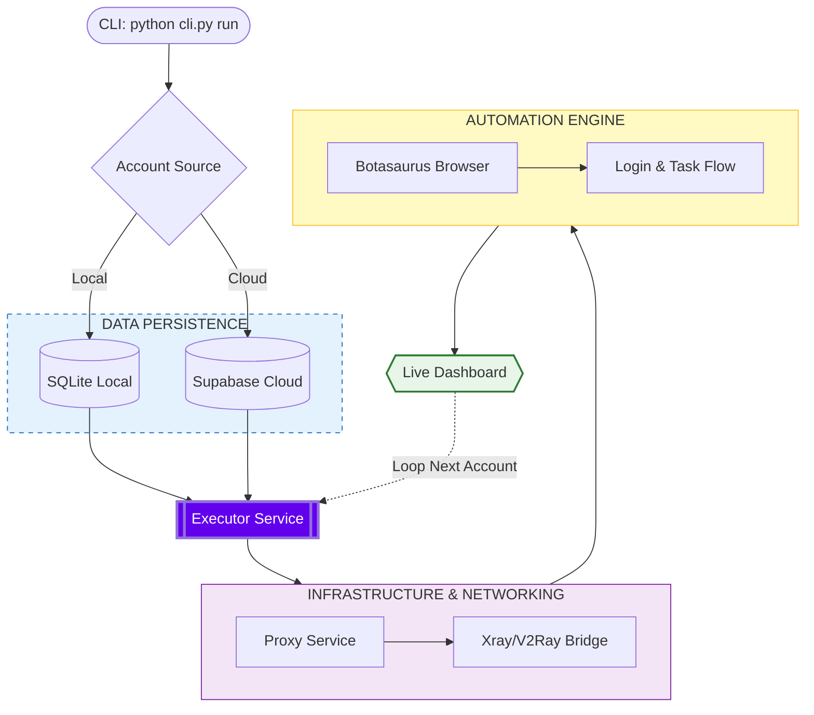

<a id="readme-top"></a>

[![Contributors][contributors-shield]][contributors-url]
[![Forks][forks-shield]][forks-url]
[![Stargazers][stars-shield]][stars-url]
[![Issues][issues-shield]][issues-url]
[![Unlicense License][license-shield]][license-url]
[![Security Research][research-shield]][research-url]

<!-- LEGAL DISCLAIMER -->
## Legal Notice — Security Research Only

> [!IMPORTANT]
> **This project is a SECURITY RESEARCH tool. It is NOT intended for fraud, profit, or unauthorized access.**

This project was developed to **test and demonstrate the effectiveness of Microsoft Rewards' bot detection systems**. The core finding is that **Microsoft's security works — bot activity is detected and fraudulent point redemptions are blocked.**

By accessing or using this software, you acknowledge and agree:

### What This Project Proves

- **Bot detection works**: Microsoft identifies automated activity patterns.
- **Redemption blocking works**: Fraudulently accumulated points **cannot** be redeemed.
- **Zero real gain**: The researcher was **unable to profit** from automation.
- **Robust system**: No successful exploitation was possible.

### Prohibited Uses

- Real-world farming or automation of Microsoft Rewards points.
- Commercial exploitation of any kind.
- Any unauthorized access to Microsoft services.
- Circumventing Microsoft's Terms of Service.

### Permitted Uses (Educational)

- Academic and security research.
- Understanding bot detection mechanisms.
- Security analysis and anti-bot pattern study.
- Learning software architecture and design patterns.

> [!WARNING]
> This project did **NOT** result in any illicit gain. Microsoft detects and blocks the activity. All accumulated points are automatically blocked from redemption, **proving that the security system works effectively**.

> **Microsoft Security Team**: If you are reviewing this project for internal security purposes, please reach out. This project was developed with constructive intent to demonstrate the robustness of your detection systems. The repository will be taken down immediately upon request, and the author is available to assist in strengthening defenses.


<!-- PROJECT LOGO -->
<br />
<div align="center">

  <h3 align="center">RaxyMS</h3>

  <p align="center">
    A security research tool for testing Microsoft Rewards bot detection systems. Built with Python and Clean Architecture.
    <br />
    <a href="docs/index.md"><strong>Explore the docs »</strong></a>
    <br />
    <br />
    <a href="https://github.com/leonifrazao/RaxyMS-Security-Audit">Repository</a>
    &middot;
    <a href="https://github.com/leonifrazao/RaxyMS-Security-Audit/issues/new?labels=bug&template=bug-report---.md">Report Bug</a>
    &middot;
    <a href="https://github.com/leonifrazao/RaxyMS-Security-Audit/issues/new?labels=enhancement&template=feature-request---.md">Request Feature</a>
  </p>
</div>


<!-- TABLE OF CONTENTS -->
<details>
  <summary>Table of Contents</summary>
  <ol>
    <li>
      <a href="#about-the-project">About The Project</a>
      <ul>
        <li><a href="#key-findings">Key Findings</a></li>
      </ul>
    </li>
    <li><a href="#technical-stack">Technical Stack</a></li>
    <li>
      <a href="#architecture--design-patterns">Architecture & Design Patterns</a>
      <ul>
        <li><a href="#code-structure">Code Structure</a></li>
      </ul>
    </li>
    <li><a href="#features">Features</a></li>
    <li><a href="#how-it-works">How It Works</a></li>
    <li><a href="#research-methodology">Research Methodology</a></li>
    <li>
      <a href="#installation">Installation</a>
      <ul>
        <li><a href="#option-1-using-nix-recommended">Nix</a></li>
        <li><a href="#option-2-manual-installation">Manual</a></li>
      </ul>
    </li>
    <li><a href="#usage">Usage</a></li>
    <li><a href="#findings--conclusions">Findings & Conclusions</a></li>
    <li><a href="#contributing">Contributing</a></li>
    <li><a href="#license">License</a></li>
    <li><a href="#contact">Contact</a></li>
    <li><a href="#acknowledgments">Acknowledgments</a></li>
  </ol>
</details>


<!-- ABOUT THE PROJECT -->
## About The Project

**RaxyMS** is a security research project designed to evaluate the robustness of Microsoft Rewards' anti-bot detection mechanisms. It simulates a full-scale automation attempt — including login, activity simulation, proxy rotation, and multi-account management — to determine whether Microsoft can detect and neutralize such behavior.

**This research follows responsible disclosure practices and serves the security community by validating anti-fraud infrastructure.**

**The conclusion is clear: Microsoft's systems are effective.** Bot activity is identified, flagged, and fraudulent points are blocked before redemption. This project serves as proof of that effectiveness.

<p align="right">(<a href="#readme-top">back to top</a>)</p>


### Key Findings

| Area | Result | Details |
| :--- | :---: | :--- |
| **Bot Detection** | Works | Activity patterns are identified and flagged. |
| **Redemption Blocking** | Works | Fraudulent points cannot be redeemed. |
| **Financial Gain** | Zero | Researcher was unable to profit. |
| **System Robustness** | Strong | No successful exploitation was possible. |

<p align="right">(<a href="#readme-top">back to top</a>)</p>


<!-- TECHNICAL STACK -->
## Technical Stack

| Technology | Purpose |
| :--- | :--- |
| [![Python][Python.org]][Python-url] **Python 3.10** | Core language |
| [Botasaurus](https://github.com/omkarcloud/botasaurus) | Headless browser automation |
| [Typer](https://typer.tiangolo.com/) | CLI framework |
| [Rich](https://rich.readthedocs.io/en/stable/) | Terminal UI & dashboard |
| [Xray / V2Ray](https://github.com/XTLS/Xray-core) | Proxy tunnel system |
| [SQLite](https://www.sqlite.org/index.html) | Local data storage |
| [Supabase](https://supabase.com/) | Cloud data sync |
| [Mail.tm](https://mail.tm/) | Temporary email for 2FA |
| [dependency-injector](https://python-dependency-injector.ets-labs.org/) | Dependency Injection container |

<p align="right">(<a href="#readme-top">back to top</a>)</p>


<!-- ARCHITECTURE -->
## Architecture & Design Patterns

RaxyMS follows **Clean Architecture** principles with well-defined layers and professional-grade design patterns:

| Pattern | Application |
| :--- | :--- |
| **Dependency Injection** | Centralized DI container (`container.py`) for all services. |
| **Adapter Pattern** | `BotasaurusDriver` adapts the browser automation library to a clean interface. |
| **Strategy Pattern** | Abstract service interfaces allow swapping implementations (e.g., SQLite ↔ Supabase). |
| **Domain-Driven Design** | Business entities (`Conta`, `Proxy`) are isolated from infrastructure. |
| **Domain Events** | Audit trail and observability through event dispatching. |
| **Clean Architecture** | Strict separation: Domain → Interfaces → Services → Infrastructure. |

### Code Structure

```
raxy_project/
├── raxy/
│   ├── container.py          # Dependency Injection Container
│   ├── core/                 # Configuration, Exceptions, Utilities
│   │   ├── config.py         # Centralized config system (YAML + env override)
│   │   └── exceptions.py     # Custom exception hierarchy
│   ├── domain/               # Business Entities (Models)
│   │   ├── models/           # Conta, Proxy, etc.
│   │   └── events/           # Domain Events
│   ├── interfaces/           # Abstract Contracts (ABCs)
│   │   ├── repositories/     # IContaRepository, IProxyRepository
│   │   └── services/         # IExecutorService, IProxyService
│   ├── services/             # Business Logic Implementation
│   │   ├── executor.py       # Batch processing engine
│   │   └── proxy_service.py  # Proxy lifecycle management
│   └── infrastructure/       # Concrete Implementations
│       ├── database/         # SQLite & Supabase adapters
│       ├── browser/          # BotasaurusDriver adapter
│       └── api/              # External API clients & templates
├── cli.py                    # CLI Entry Point (Typer)
├── config.yaml               # Runtime Configuration
└── config.example.yaml       # Configuration Template
```

<p align="right">(<a href="#readme-top">back to top</a>)</p>


<!-- FEATURES -->
## Features

RaxyMS implements a comprehensive automation pipeline to thoroughly test detection systems:

*   **Automated Login**: Simulates Microsoft account sign-in with session management and retry logic.
*   **Activity Simulation**: Performs searches, clicks, and navigates with randomized delays to mimic human behavior.
*   **Batch Processing**: Executes tasks across multiple accounts in parallel with configurable worker threads.
*   **Proxy System**: Full proxy lifecycle via Xray/V2Ray — auto-testing, rotation, country filtering, and bridge management.
*   **Real-time Dashboard**: Terminal-based live metrics and status updates using Rich.
*   **Session Management**: Automatic retry on failure with configurable attempts and timeouts.
*   **Temporary Email (2FA)**: Integrates Mail.tm for handling two-factor authentication challenges.
*   **Dual Storage**: Accounts stored locally (SQLite) or synced to the cloud (Supabase).

<p align="right">(<a href="#readme-top">back to top</a>)</p>


<!-- HOW IT WORKS -->
## How It Works

### The Research Process

The project simulates a **realistic bot attack** against Microsoft Rewards to assess detection effectiveness:

1.  **Setup**: Accounts and proxies are initialized from local or cloud storage.
2.  **Simulation**: Automated activity is performed (searches, clicks, navigation with randomized delays).
3.  **Detection**: Microsoft identifies bot patterns in the simulated activity.
4.  **Blocking**: Fraudulent points are blocked from redemption.
5.  **Analysis**: Results are documented and detection mechanisms are studied.

### Execution Pipeline



### What Happens Per Account

Each account encounters these stages during execution:

| Stage | Outcome |
| :--- | :--- |
| **Login** | Successful — session established |
| **Activity** | Simulated — searches, clicks, navigation |
| **Detection** | Bot detected by Microsoft |
| **Redemption** | Blocked — no exploitation possible |

<p align="right">(<a href="#readme-top">back to top</a>)</p>


<!-- RESEARCH METHODOLOGY -->
## Research Methodology

### Hypothesis

Can Microsoft Rewards' bot detection be circumvented through sophisticated automation techniques (headless browsers, proxy rotation, randomized delays, multi-account management)?

### Methodology

1.  Develop a proof-of-concept automation tool with professional-grade architecture.
2.  Implement best practices for evasion: rotating proxies, randomized human-like delays, browser fingerprint management.
3.  Attempt to accumulate and redeem points across multiple accounts.
4.  Document all detection and blocking mechanisms encountered.

### Results

**Hypothesis: Rejected.**

Microsoft's systems successfully detected and blocked all exploitation attempts, proving the robustness of their defenses. The automation was identified regardless of proxy rotation, delay randomization, or browser fingerprint changes.

<p align="right">(<a href="#readme-top">back to top</a>)</p>


<!-- INSTALLATION -->
## Installation

### Option 1: Using Nix (Recommended)

If you have [Nix](https://nixos.org/download.html) installed, the included `shell.nix` sets up everything automatically:

```sh
git clone https://github.com/leonifrazao/RaxyMS-Security-Audit.git
cd RaxyMS-Security-Audit
nix-shell
```

This provisions Python 3.10, system libraries (`glib`, `zlib`, `stdenv`), `xray`, `google-chrome`, and all Python dependencies inside a virtual environment.

### Option 2: Manual Installation

```sh
git clone https://github.com/leonifrazao/RaxyMS-Security-Audit.git
cd RaxyMS-Security-Audit/raxy_project

python3 -m venv .venv
source .venv/bin/activate

pip install .
# OR
pip install -r requirements.txt

cp config.example.yaml config.yaml
```

If using Supabase, create a `.env` file:
```env
SUPABASE_URL=your_project_url
SUPABASE_KEY=your_anon_key
```

> **Note**: For advanced settings, see the **[Installation Guide](docs/installation.md)** and **[Configuration Guide](docs/configuration.md)**.

<p align="right">(<a href="#readme-top">back to top</a>)</p>


<!-- USAGE -->
## Usage

```sh
# Run automation for all configured accounts
python cli.py run

# Run for a single account
python cli.py run --email user@example.com --password yourpassword

# Import accounts from file (email:password per line)
python cli.py accounts import users.txt

# List all stored accounts
python cli.py accounts list

# Test proxy connectivity
python cli.py proxy test --threads 20 --country US

# Start proxy bridges
python cli.py proxy start

# Full help
python cli.py --help
```

> **Note**: For comprehensive command details, see the **[Usage Guide](docs/usage.md)**.

<p align="right">(<a href="#readme-top">back to top</a>)</p>


<!-- FINDINGS & CONCLUSIONS -->
## Findings & Conclusions

### Security Assessment Results

After extensive testing, the research concludes that **Microsoft Rewards has a robust and effective anti-bot system**:

| Test Vector | Microsoft Response | Effectiveness |
| :--- | :--- | :---: |
| Automated searches | Pattern detected and flagged | High |
| Multi-account batch processing | Accounts flagged for suspicious activity | High |
| Proxy rotation (multiple IPs) | Detection persists despite IP changes | High |
| Headless browser fingerprinting | Browser signatures identified | High |
| Point redemption attempts | **Blocked before redemption** | Critical |

### Conclusion

> Microsoft's bot detection infrastructure successfully identifies automated activity regardless of sophistication level. The system demonstrates multiple layers of defense — from behavioral analysis to redemption-stage verification — ensuring that fraudulent points have **zero monetary value**.

<p align="right">(<a href="#readme-top">back to top</a>)</p>


### Top contributors:

<a href="https://github.com/leonifrazao/RaxyMS-Security-Audit/graphs/contributors">
  
</a>

<p align="right">(<a href="#readme-top">back to top</a>)</p>

<!-- CONTRIBUTING -->
## Contributing

Contributions to improve the research methodology or codebase are welcome.

1.  Fork the Project
2.  Create your Feature Branch (`git checkout -b feature/AmazingFeature`)
3.  Commit your Changes (`git commit -m 'Add some AmazingFeature'`)
4.  Push to the Branch (`git push origin feature/AmazingFeature`)
5.  Open a Pull Request

> **Note**: Developers should read the **[Development Guide](docs/development.md)** for architecture details and contribution standards.

<p align="right">(<a href="#readme-top">back to top</a>)</p>


<!-- LICENSE -->
## License

Distributed under the GPL-3.0 license. See `LICENSE` for more information.

<p align="right">(<a href="#readme-top">back to top</a>)</p>


<!-- CONTACT -->
## Contact

Leoni Frazão - leoni.frazao.oliveira@gmail.com

Project Link: [https://github.com/leonifrazao/RaxyMS-Security-Audit](https://github.com/leonifrazao/RaxyMS-Security-Audit)

<p align="right">(<a href="#readme-top">back to top</a>)</p>


<!-- ACKNOWLEDGMENTS -->
## Acknowledgments

*   [Typer](https://typer.tiangolo.com/)
*   [Rich](https://rich.readthedocs.io/en/stable/)
*   [Botasaurus](https://github.com/omkarcloud/botasaurus)
*   [dependency-injector](https://python-dependency-injector.ets-labs.org/)
*   [Best-README-Template](https://github.com/othneildrew/Best-README-Template)

<p align="right">(<a href="#readme-top">back to top</a>)</p>


<!-- MARKDOWN LINKS & IMAGES -->
[contributors-shield]: https://img.shields.io/github/contributors/leonifrazao/RaxyMS-Security-Audit.svg?style=for-the-badge
[contributors-url]: https://github.com/leonifrazao/RaxyMS-Security-Audit/graphs/contributors
[forks-shield]: https://img.shields.io/github/forks/leonifrazao/RaxyMS-Security-Audit.svg?style=for-the-badge
[forks-url]: https://github.com/leonifrazao/RaxyMS-Security-Audit/network/members
[stars-shield]: https://img.shields.io/github/stars/leonifrazao/RaxyMS-Security-Audit.svg?style=for-the-badge
[stars-url]: https://github.com/leonifrazao/RaxyMS-Security-Audit/stargazers
[issues-shield]: https://img.shields.io/github/issues/leonifrazao/RaxyMS-Security-Audit.svg?style=for-the-badge
[issues-url]: https://github.com/leonifrazao/RaxyMS-Security-Audit/issues
[license-shield]: https://img.shields.io/github/license/leonifrazao/RaxyMS-Security-Audit.svg?style=for-the-badge
[license-url]: https://github.com/leonifrazao/RaxyMS-Security-Audit/blob/master/LICENSE.txt
[Python.org]: https://img.shields.io/badge/Python-3776AB?style=for-the-badge&logo=python&logoColor=white
[Python-url]: https://python.org
[research-shield]: https://img.shields.io/badge/Security%20Research-Yes-brightgreen?style=for-the-badge
[research-url]: #legal-notice--security-research-only
